# Kubernetes Advanced

## Table of Contents

- [Downsides of Services](#downsides-of-services)
- [What Ingress Actually Is](#what-ingress-actually-is)
- [Namespaces](#namespaces)
  - [Why Use Namespaces](#why-use-namespaces)
  - [Viewing Existing Namespaces](#viewing-existing-namespaces)
  - [Creating and Using a Namespace](#creating-and-using-a-namespace)
  - [Setting a Default Namespace for Your Session](#setting-a-default-namespace-for-your-session)
- [Ingress and Ingress Controllers](#ingress-and-ingress-controllers)
  - [What is an Ingress Controller](#what-is-an-ingress-controller)
  - [Installing the NGINX Ingress Controller with Helm](#installing-the-nginx-ingress-controller-with-helm)
  - [Setting Up Path-Based Routing](#setting-up-path-based-routing)
  - [Testing Locally with /etc/hosts Spoofing](#testing-locally-with-etchosts-spoofing)
  - [Exploring Traefik](#exploring-traefik-an-alternative-ingress-controller)
- [Secrets and ConfigMaps](#secrets-and-configmaps)
  - [ConfigMap](#configmap)
  - [Secret](#secret)
  - [ConfigMap vs Secret](#configmap-vs-secret)
- [Volumes in Docker](#volumes-in-docker)
  - [Bind Mounts](#bind-mounts)
  - [Volume Mounts](#volume-mounts)
- [Volumes in Kubernetes](#volumes-in-kubernetes)
  - [Types of Volumes](#types-of-volumes)
  - [Ephemeral Volumes in Practice](#ephemeral-volumes-in-practice)
  - [Static Persistent Volumes in Practice](#static-persistent-volumes-in-practice)
  - [Dynamic PV Provisioning](#dynamic-pv-provisioning-cloud)
- [Horizontal Pod Autoscaler](#horizontal-pod-autoscaler-hpa)
  - [How HPA Works Internally](#how-hpa-works-internally)
  - [Installing metrics-server](#installing-metrics-server)
  - [App for Testing](#the-app-for-testing)
  - [Creating the Manifests](#creating-the-manifests)
  - [Why Resource Requests Are Required for HPA](#why-resource-requests-are-required-for-hpa)
  - [Load Testing and Watching HPA React](#load-testing-and-watching-hpa-react)
  - [The Scaling Formula](#the-scaling-formula)
- [Resource Requests and Limits](#resource-requests-and-limits)
- [Cluster Autoscaling](#cluster-autoscaling)
  - [Enabling It](#enabling-it)
  - [Watching It Scale Up](#watching-it-scale-up)
  - [HPA and Cluster Autoscaler Together](#hpa-and-cluster-autoscaler-together)

---

## Downsides of Services

Say your app has three pieces - a React frontend, a Node.js API, and a WebSocket server. You deploy all three on Kubernetes. Now you need to expose them to the internet.

With just Services, your only production-grade option is a `LoadBalancer` service for each one. That means:

```
User → LB1 (IP: 34.10.20.1)  → frontend pods
User → LB2 (IP: 34.10.20.2)  → backend pods
User → LB3 (IP: 34.10.20.3)  → websocket pods
```

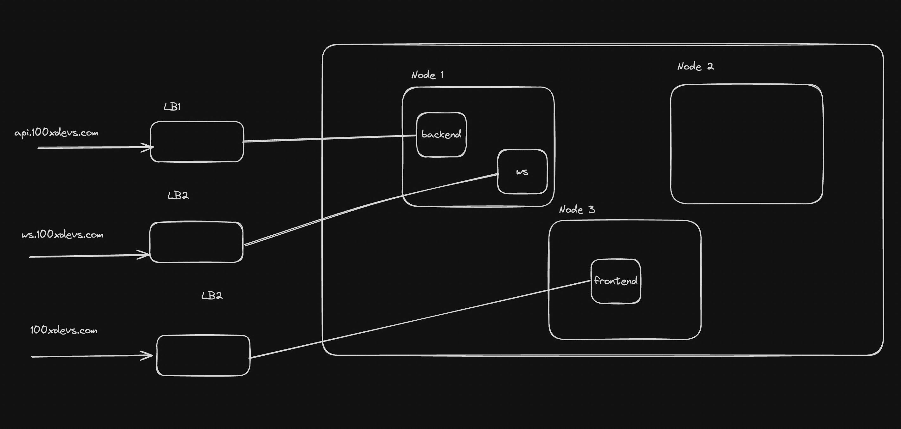

**The three concrete problems:**

**1. No path-based routing from a single IP**

There is no built-in way to say "if the request comes to `/api`, send it to the backend service, otherwise send it to the frontend" - not without something sitting in front that can read the URL and decide.

**2. Certificate management becomes a nightmare**

TLS certificates are attached per load balancer. Three apps = three certs. Ten apps = ten certs. You manage renewals, mismatches, and expiry outside the cluster, manually, forever.

**3. No shared traffic policies**

Rate limiting, authentication, CORS headers, request logging - if you want any of this applied consistently, you have to configure it on every single service independently. Change the rate limit? Update all of them.

Each load balancer can have its own set of rate limits, but you cant create a single rate limitter for all your services. 

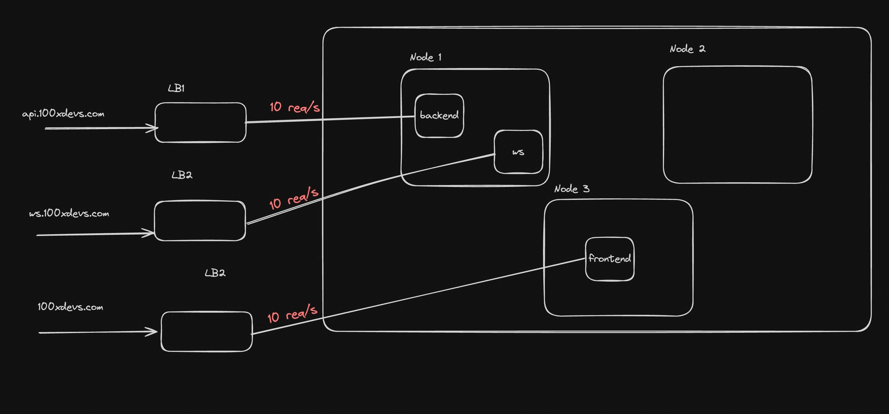

When your app hits any of these walls, the answer is **Ingress**.

---

## What Ingress Actually Is

Ingress is a Kubernetes API object. It is just a set of routing rules written in YAML, sitting inside your cluster.

By itself, it does nothing. It's a config file. What actually processes those rules and handles traffic is the **Ingress Controller** - a pod running inside your cluster that watches for Ingress objects and acts on them.

The relationship:

```
Ingress resource     →   the rules you write ("send /api to backend-service")
Ingress Controller   →   the process that reads those rules and actually routes traffic
```

This split is intentional. Kubernetes defines the API object (Ingress), but it deliberately does not ship a built-in controller for it. You pick and install whichever controller fits your needs - NGINX, Traefik, HAProxy, etc.

Full list of controllers → https://kubernetes.io/docs/concepts/services-networking/ingress-controllers/

> This is the same pattern as everything else in Kubernetes. You create a `Deployment`, but you didn't install the Deployment controller - it came with the cluster. Ingress is different: the controller is not included. You bring your own.


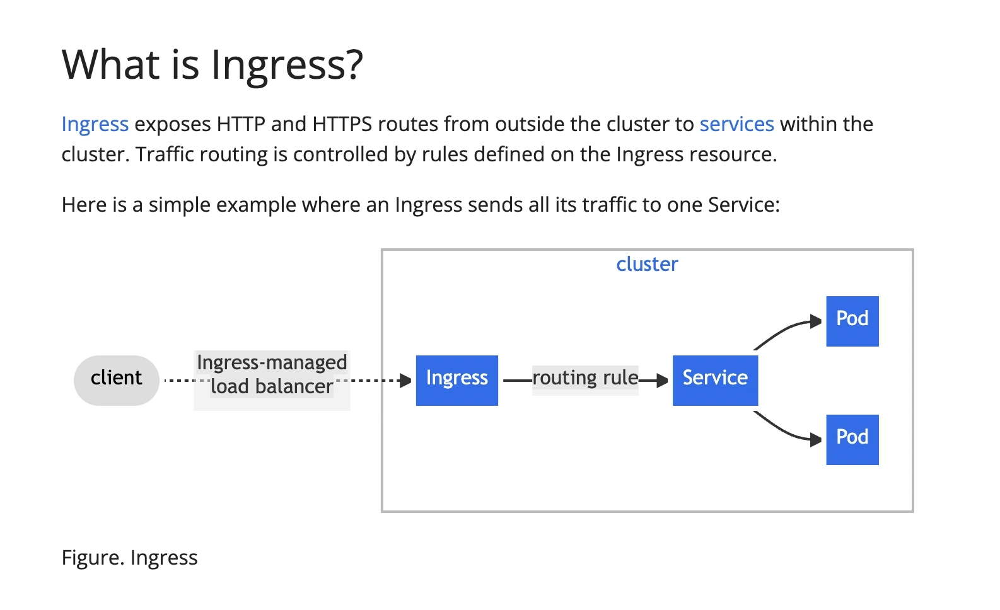

---

## Namespaces

### Why Use Namespaces

Imagine you have one big office building (your Kubernetes cluster), but multiple teams working inside it - a backend team, a frontend team, a QA team. You don't want their stuff mixed up on the same desk. **Namespaces are like separate floors in that building.** Each team gets their own floor, isolated from the others.

In Kubernetes, a **namespace** is a logical boundary that divides cluster resources among multiple users, teams, or environments (like `dev`, `staging`, `production`).

| Without Namespaces | With Namespaces |
|---|---|
| All pods/services pile up in `default` | Each team/env has its own isolated space |
| Hard to tell which pod belongs to which app | Resources are logically grouped |
| Accidental deletes affect everything | Scoped operations reduce blast radius |
| No resource quotas per team | You can limit CPU/memory per namespace |

> By default, when you run any `kubectl` command without specifying a namespace, it talks to the `default` namespace - the ground floor everyone lands on.

---

### Viewing Existing Namespaces

```bash
kubectl get namespaces
```

Kubernetes ships with a few built-in namespaces:

- `default` - where your resources go if you don't specify one
- `kube-system` - internal Kubernetes system components live here
- `kube-public` - publicly readable, rarely used
- `kube-node-lease` - used for node heartbeats

To see all pods across all namespaces (including internal system pods):

```bash
kubectl get pods --all-namespaces
```

---

### Creating and Using a Namespace

**Step 1 - Create a new namespace**

```bash
kubectl create namespace backend-team
```

**Step 2 - Deploy into that namespace**

Add `namespace: backend-team` under the `metadata` section of your manifest:

```yaml
apiVersion: apps/v1
kind: Deployment
metadata:
  name: nginx-deployment
  namespace: backend-team      # This is the key line
spec:
  replicas: 3
  selector:
    matchLabels:
      app: nginx
  template:
    metadata:
      labels:
        app: nginx
    spec:
      containers:
      - name: nginx
        image: nginx:latest
        ports:
        - containerPort: 80
```

```bash
kubectl apply -f deployment-ns.yml
```

**Step 3 - Query resources in a specific namespace**

```bash
kubectl get deployments -n backend-team
kubectl get pods -n backend-team
```

> The `-n` flag (or `--namespace`) tells kubectl which namespace to look in.

---

### Setting a Default Namespace for Your Session

Tired of typing `-n backend-team` every time? Set it as your default context:

```bash
kubectl config set-context --current --namespace=backend-team
```

Now `kubectl get pods` automatically looks in `backend-team`. To switch back:

```bash
kubectl config set-context --current --namespace=default
```

> This modifies your `~/.kube/config` file. In multi-cluster setups, be careful not to confuse this with switching clusters - that requires `kubectl config use-context`.

---

## Ingress and Ingress Controllers

Without Ingress, every service you want to expose to the internet needs its own `LoadBalancer` - which means a separate cloud load balancer (and a separate bill) for each one.

**Ingress lets you have one load balancer in front, and route traffic to many services based on the URL path or hostname.**

```
Internet
    |
    v
[Load Balancer]  ← just ONE
    |
    v
[Ingress Controller]
    ├── /nginx  → nginx-service
    └── /apache → apache-service
```

---

### What is an Ingress Controller

Kubernetes defines an **Ingress resource** (a routing rule), but it doesn't come with something to enforce it. That enforcer is the **Ingress Controller** - a pod that reads your Ingress rules and configures a real proxy (like nginx or Traefik) accordingly.

Think of the Ingress resource as a menu and the Ingress Controller as the waiter who actually takes your order to the kitchen.

---

### Installing the NGINX Ingress Controller with Helm

**What is Helm?**

Helm is the package manager for Kubernetes. Instead of writing hundreds of lines of YAML yourself, Helm lets you install complex apps (like an ingress controller) with a single command using pre-built **charts**.

Install Helm → https://helm.sh/docs/intro/install/

**Install the NGINX Ingress Controller:**

```bash
# Add the ingress-nginx chart repository
helm repo add ingress-nginx https://kubernetes.github.io/ingress-nginx
helm repo update

# Install it into its own namespace
helm install nginx-ingress ingress-nginx/ingress-nginx \
  --namespace ingress-nginx \
  --create-namespace
```

**Verify it's running:**

```bash
kubectl get pods -n ingress-nginx
kubectl get svc -n ingress-nginx
```

You'll notice a `LoadBalancer` service was automatically created. This is your single entry point into the cluster - the cloud provider assigns it a public IP. All traffic hits this one IP, and the nginx controller pod routes it to the right service.

```bash
kubectl get services --all-namespaces
```

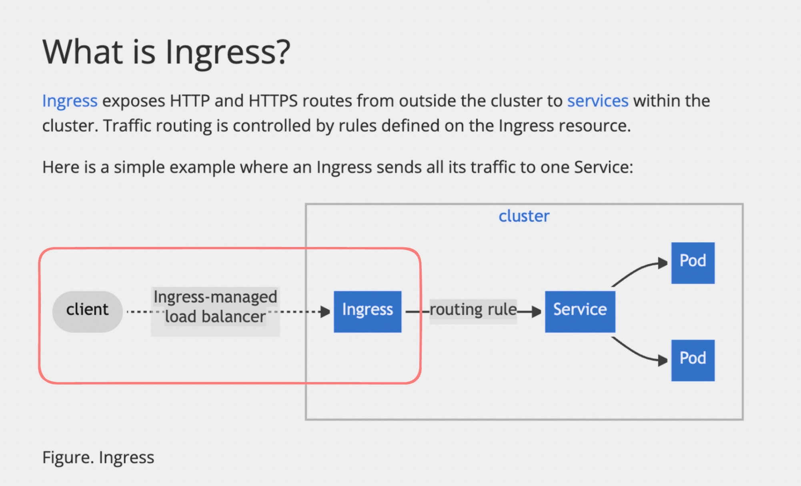

---

### Setting Up Path-Based Routing

Route `your-domain.com/nginx` to nginx app and `your-domain.com/apache` to apache app.

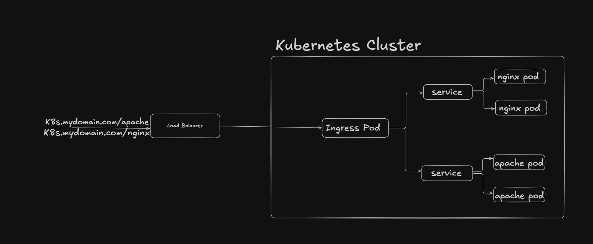

**Step 1 - Clean up old deployments**

```bash
kubectl delete deployment --all
kubectl delete service --all
# Do not delete the default kubernetes service
```

**Step 2 - Deploy nginx app with ClusterIP service**

```yaml
apiVersion: apps/v1
kind: Deployment
metadata:
  name: nginx-deployment
  namespace: default
spec:
  replicas: 2
  selector:
    matchLabels:
      app: nginx
  template:
    metadata:
      labels:
        app: nginx
    spec:
      containers:
      - name: nginx
        image: nginx:alpine
        ports:
        - containerPort: 80
---
apiVersion: v1
kind: Service
metadata:
  name: nginx-service
  namespace: default
spec:
  selector:
    app: nginx
  ports:
    - protocol: TCP
      port: 80
      targetPort: 80
  type: ClusterIP     # Internal only - Ingress handles external access
```

**Step 3 - Deploy apache app with ClusterIP service**

```yaml
apiVersion: apps/v1
kind: Deployment
metadata:
  name: apache-deployment
  namespace: default
spec:
  replicas: 2
  selector:
    matchLabels:
      app: apache
  template:
    metadata:
      labels:
        app: apache
    spec:
      containers:
      - name: my-apache-site
        image: httpd:2.4
        ports:
        - containerPort: 80
---
apiVersion: v1
kind: Service
metadata:
  name: apache-service
  namespace: default
spec:
  selector:
    app: apache
  ports:
    - protocol: TCP
      port: 80
      targetPort: 80
  type: ClusterIP
```

> **Why ClusterIP?** These services don't need their own public IPs anymore. The Ingress controller will forward traffic to them internally. `ClusterIP` = only reachable inside the cluster.

**Step 4 - Create the Ingress resource**

```yaml
apiVersion: networking.k8s.io/v1
kind: Ingress
metadata:
  name: web-apps-ingress
  namespace: default
  annotations:
    nginx.ingress.kubernetes.io/rewrite-target: /   # strips the path prefix before forwarding
spec:
  ingressClassName: nginx      # tells K8s which controller handles this
  rules:
  - host: your-domain.com
    http:
      paths:
      - path: /nginx
        pathType: Prefix
        backend:
          service:
            name: nginx-service
            port:
              number: 80
      - path: /apache
        pathType: Prefix
        backend:
          service:
            name: apache-service
            port:
              number: 80
```

```bash
kubectl apply -f ingress.yml
```

> **What does `rewrite-target: /` do?** Without it, your nginx service receives the request as `/nginx/index.html` - but it only knows how to serve `/index.html`. The rewrite strips the prefix so the service sees a clean path.

---

### Testing Locally with /etc/hosts Spoofing

You don't need to own `your-domain.com` to test this. Add an entry to your local hosts file to trick your machine into routing that domain to your load balancer IP:

```
# On Linux/Mac: /etc/hosts
# On Windows: C:\Windows\System32\drivers\etc\hosts

65.20.84.86    your-domain.com
```

Now visit:

- `http://your-domain.com/nginx` → should show the nginx welcome page
- `http://your-domain.com/apache` → should show the Apache "It Works!" page

---

### Exploring Traefik: An Alternative Ingress Controller

Traefik is another popular ingress controller - cloud-native, auto-discovers services, and has a built-in dashboard.

**Install Traefik via Helm:**

```bash
helm repo add traefik https://helm.traefik.io/traefik
helm repo update
helm install traefik traefik/traefik --namespace traefik --create-namespace
```

**Verify IngressClass and LoadBalancer:**

```bash
kubectl get IngressClass        # should show 'traefik'
kubectl get svc -n traefik      # note the LoadBalancer IP
```

**Create an Ingress using the Traefik IngressClass:**

```yaml
apiVersion: networking.k8s.io/v1
kind: Ingress
metadata:
  name: traefik-web-apps-ingress
  namespace: default
spec:
  ingressClassName: traefik     # this is what switches from nginx to traefik
  rules:
  - host: traefik-domain.com
    http:
      paths:
      - path: /nginx
        pathType: Prefix
        backend:
          service:
            name: nginx-service
            port:
              number: 80
      - path: /apache
        pathType: Prefix
        backend:
          service:
            name: apache-service
            port:
              number: 80
```

Add to `/etc/hosts` (use your Traefik LoadBalancer IP this time):

```
65.20.90.183    traefik-domain.com
```

Then visit `traefik-domain.com/nginx` and `traefik-domain.com/apache`.

**Why isn't Traefik showing anything?**

After setting up Traefik, pages may not load correctly. Think about the `rewrite-target` annotation we used with nginx. Traefik handles path rewriting differently - it uses its own set of annotations called **middlewares**. Without a strip-prefix middleware, Traefik forwards `/nginx/...` as-is to the nginx service, which has no idea how to handle a request coming in at `/nginx`.

In Traefik, you'd fix this with a `StripPrefix` middleware. Each ingress controller has its own annotation and configuration syntax - this is why `ingressClassName` matters and why you can't always copy an nginx Ingress manifest and expect it to work with Traefik.

---

## Secrets and ConfigMaps

A rule you'll hear constantly in real Kubernetes work: **don't bake secrets into your Docker image.** The same way you'd never commit a `.env` file with real passwords to GitHub, you never embed credentials inside a container image or hardcode them in a manifest YAML.

Kubernetes gives you two purpose-built API objects to handle this cleanly:

- **ConfigMap** - for non-sensitive configuration (URLs, limits, timeouts)
- **Secret** - for sensitive data (passwords, tokens, SSH keys)

---

### ConfigMap

A ConfigMap stores non-confidential data as plain-text key-value pairs. Pods can consume them as environment variables, command-line arguments, or mounted files.

Think of it as your app's settings file - living inside Kubernetes rather than baked into the image.

**Creating a ConfigMap:**

```yaml
apiVersion: v1
kind: ConfigMap
metadata:
  name: ecom-backend-config
data:
  database_url: "mysql://ecom-db:3306/shop"
  cache_size: "1000"
  payment_gateway_url: "https://payment-gateway.example.com"
  max_cart_items: "50"
  session_timeout: "3600"
```

```bash
# Apply it
kubectl apply -f configmap.yml

# Verify it exists
kubectl get configmap

# See the full contents
kubectl describe configmap ecom-backend-config
```

**Using a ConfigMap in a Deployment:**

Instead of hardcoding env vars in your deployment manifest, you reference the ConfigMap:

```yaml
containers:
- name: ecom-backend
  image: img/env-backend
  ports:
  - containerPort: 3000
  env:
  - name: DATABASE_URL
    valueFrom:
      configMapKeyRef:
        name: ecom-backend-config   # which ConfigMap
        key: database_url           # which key inside it
  - name: CACHE_SIZE
    valueFrom:
      configMapKeyRef:
        name: ecom-backend-config
        key: cache_size
  - name: PAYMENT_GATEWAY_URL
    valueFrom:
      configMapKeyRef:
        name: ecom-backend-config
        key: payment_gateway_url
  - name: MAX_CART_ITEMS
    valueFrom:
      configMapKeyRef:
        name: ecom-backend-config
        key: max_cart_items
  - name: SESSION_TIMEOUT
    valueFrom:
      configMapKeyRef:
        name: ecom-backend-config
        key: session_timeout
```

Each `configMapKeyRef` block says: go to this ConfigMap, grab this key, and inject it as this environment variable. The container sees `DATABASE_URL`, `CACHE_SIZE`, etc. exactly like regular env vars - it doesn't know or care where they came from.

**Expose it as a Service and test:**

```yaml
apiVersion: v1
kind: Service
metadata:
  name: ecom-backend-service
spec:
  type: NodePort
  selector:
    app: ecom-backend
  ports:
    - port: 3000
      targetPort: 3000
      nodePort: 30007
```

```bash
kubectl apply -f deployment.yml
kubectl apply -f service.yml
kubectl get deployment
kubectl get service
```

To clean up:

```bash
kubectl delete -f service.yml
kubectl delete -f deployment.yml
```

---

### Secret

A Secret is structurally similar to a ConfigMap, but designed for sensitive data. The key difference: values are **base64 encoded**.

**What is Base64 Encoding?**

Base64 converts binary data into a safe ASCII string. For example, `hello` becomes `aGVsbG8=`.

> **Important:** Base64 is encoding, not encryption. Anyone with access to the Secret object can decode it instantly. Its purpose is standardization - not security. It lets you safely store binary data (like TLS certificates) as text in YAML.

To encode a value:

```bash
echo -n 'mypassword' | base64
# → bXlwYXNzd29yZA==
```

**Creating a Secret:**

```yaml
apiVersion: v1
kind: Secret
metadata:
  name: ecom-backend-secret
type: Opaque        # default type - generic key-value secret
data:
  database_password: cGFzc3dvcmQ=      # base64 of 'password'
  payment_gateway_token: dG9rZW4=      # base64 of 'token'
```

```bash
kubectl apply -f secret.yml
kubectl get secret
kubectl describe secret ecom-backend-secret
# Note: describe shows keys but NOT their values - intentional
```

**Using a Secret as Environment Variables:**

```yaml
containers:
- name: ecom-backend
  image: img/env-backend
  env:
  - name: DATABASE_PASSWORD
    valueFrom:
      secretKeyRef:
        name: ecom-backend-secret   # which Secret
        key: database_password      # which key inside it
  - name: PAYMENT_GATEWAY_TOKEN
    valueFrom:
      secretKeyRef:
        name: ecom-backend-secret
        key: payment_gateway_token
```

The pattern is identical to ConfigMap - just `secretKeyRef` instead of `configMapKeyRef`.

**Mounting a Secret as a File:**

Sometimes you need secrets as a file rather than an env var (e.g., a `.env` file your app reads on startup):

```yaml
apiVersion: v1
kind: Secret
metadata:
  name: dotfile-secret
data:
  .env: REFUQUJBU0VfVVJMPSJwb3N0Z3JlczovL3VzZXJuYW1lOnNlY3JldEBsb2NhbGhvc3QvcG9zdGdyZXMi
---
apiVersion: v1
kind: Pod
metadata:
  name: secret-dotfiles-pod
spec:
  containers:
  - name: dotfile-test-container
    image: nginx
    volumeMounts:
    - name: env-file
      readOnly: true
      mountPath: "/etc/secret-volume"   # file appears here inside the container
  volumes:
  - name: env-file
    secret:
      secretName: dotfile-secret
```

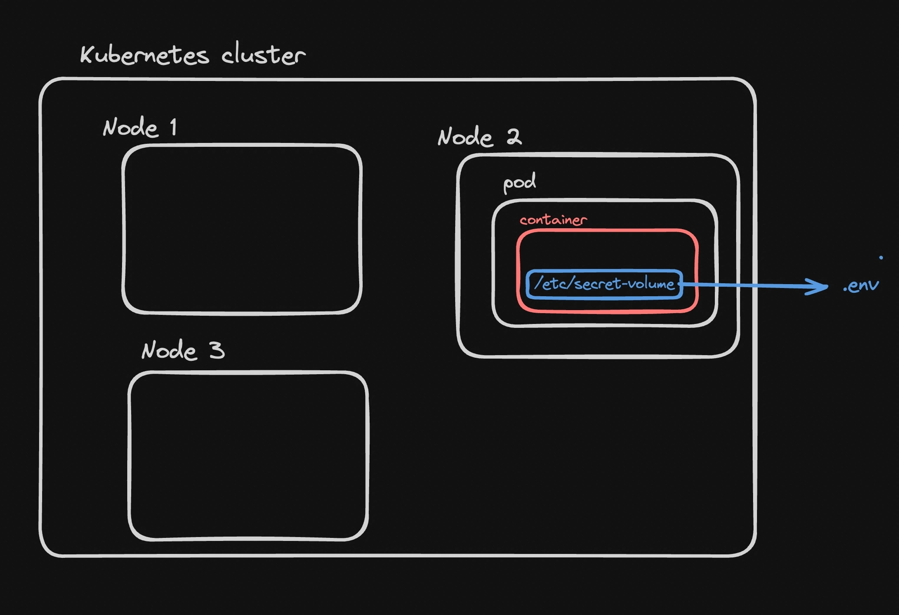

```bash
kubectl apply -f secret-pod.yml

# Exec into the container and inspect the mounted secret
kubectl exec -it secret-dotfiles-pod -- /bin/bash
cd /etc/secret-volume/
ls        # you'll see a .env file
cat .env  # decoded contents
```

---

### ConfigMap vs Secret

| | ConfigMap | Secret |
|---|---|---|
| Purpose | Non-sensitive config (URLs, limits, flags) | Sensitive data (passwords, tokens, keys) |
| Storage format | Plain text | Base64 encoded |
| View values with `describe` | Yes, visible | No - keys shown, values hidden |
| Encryption at rest | No | Yes, when configured |
| External integrations | None | Works with Vault, AWS Secrets Manager via CSI driver |

> For production systems, base64 in Secrets alone is not sufficient security. Kubernetes supports encryption at rest for Secrets and integrates with external secret management systems via the [Secrets Store CSI Driver](https://secrets-store-csi-driver.sigs.k8s.io/concepts.html).

**Quick Reference - Key Commands:**

```bash
# ConfigMap
kubectl apply -f configmap.yml
kubectl get configmap
kubectl describe configmap <name>

# Secret
kubectl apply -f secret.yml
kubectl get secret
kubectl describe secret <name>       # values are hidden

# Encode a value for a Secret
echo -n 'yourvalue' | base64

# Decode a Secret value
echo 'YWRtaW4=' | base64 --decode
```

**The Mental Model:**

```
Your App
  └── reads env vars at startup
         ├── DATABASE_URL      ← injected from ConfigMap
         ├── CACHE_SIZE        ← injected from ConfigMap
         └── DATABASE_PASSWORD ← injected from Secret
```

The container sees everything as plain environment variables. The separation of ConfigMap vs Secret is entirely for your organizational clarity and Kubernetes access control - not something the app itself needs to know about.

---

## Volumes in Docker

### The Problem First

When a Docker container runs, it gets its own isolated filesystem. Any file it creates, any data it writes - all of it lives inside that container's layer. The moment the container stops or crashes, everything it wrote is gone.

Run this image to see it firsthand. It's a Node.js app that periodically writes random data to a file:

```bash
docker run project/write-random
```

Shell into the running container and read the file:

```bash
docker exec -it <container_id> /bin/bash
cat randomData.txt
```

You'll see data there. Now stop the container and start it again. The file is gone. This is called **ephemeral storage** - the data lives and dies with the container.

This is fine for stateless apps. It is a real problem the moment you run anything that needs to remember state - databases, file uploads, logs, anything.

---

### Volumes in Docker

Volumes solve this. A volume is a directory that exists **outside** the container's own filesystem, on the host machine. When a container writes to a volume, the data is actually written to the host. When the container dies, the data stays.

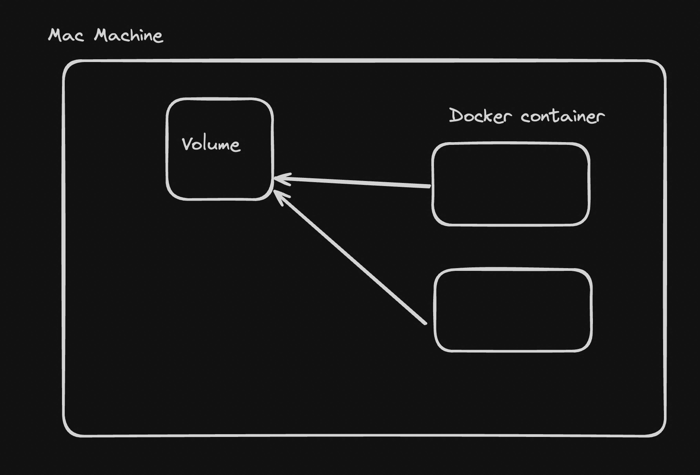

---

### Bind Mounts

A bind mount maps a specific directory on your host machine directly into the container.

```bash
docker run -v /Users/yourname/Projects/mount:/usr/src/app/generated project/write-random
```

The path on the left of `:` is the folder on your machine. The path on the right is where the container sees it. Anything the container writes to `/usr/src/app/generated` is actually being written to `/Users/yourname/Projects/mount` on your laptop.

Stop the container. Check that folder. The `randomData.txt` file is there.

The downside: bind mounts are tied to a specific path on a specific machine. They don't travel well.

---

### Volume Mounts

Docker-managed volumes are more portable. Docker handles where on the host the data lives - you just give the volume a name.

Create a volume:

```bash
docker volume create hello
```

Use it:

```bash
docker run -v hello:/usr/src/app/generated project/write-random
```

The container writes to `/usr/src/app/generated`. Docker stores that data in the named volume `hello`. Stop and restart the container - the data is still there.

The difference from bind mounts: you're not hardcoding a host path. Docker manages the storage location. This is easier to work with across different machines and in CI environments.

---

## Volumes in Kubernetes

Ref - https://kubernetes.io/docs/concepts/storage/volumes/

The same problem exists in Kubernetes, but it is more complex because:

- Pods can have multiple containers that need to share data between them
- A pod can be rescheduled to a completely different node, not just restarted
- Some data needs to survive pod death entirely (databases)
- Some data only needs to survive for the life of the pod (caches, temp files)

**Three specific situations where you need volumes:**

**Two containers in the same pod need to share data.** Containers inside a pod are separate processes. They don't share a filesystem by default. If a sidecar container needs to read logs that your main container writes, they need a shared volume.

**You're running a database inside a pod.** If your MongoDB pod gets restarted and its data directory is inside the container, every restart wipes the database. You need the data directory mounted to something that outlives the pod.

**A pod needs temporary scratch space during execution.** Say a video processing pod needs to write intermediate files while it works, but doesn't care if those files survive after it finishes. An ephemeral volume handles this without wasting persistent storage.

---

### Types of Volumes

#### Ephemeral Volumes

Temporary volumes that exist only as long as the pod exists. When the pod is deleted, the volume is deleted with it. Useful for sharing data between containers in the same pod, or for scratch space.

The most common type is `emptyDir`:

```yaml
volumes:
- name: shared-data
  emptyDir: {}
```

Other examples of ephemeral volumes: `configMap`, `secret` (both mount cluster data into the pod as files).

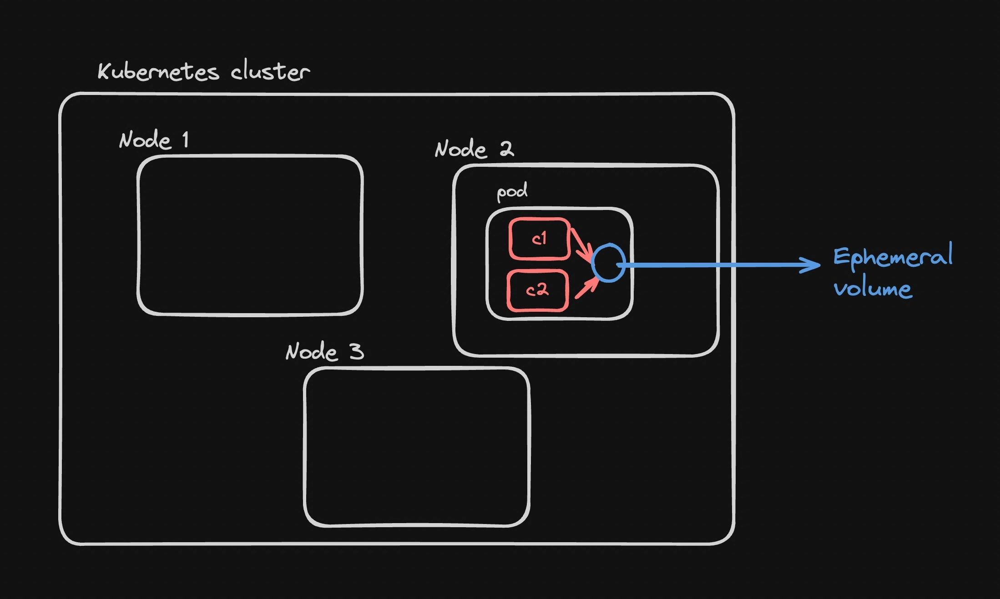

#### Persistent Volumes

A **Persistent Volume (PV)** is a piece of storage in the cluster that has a lifecycle completely independent of any pod. It can be backed by NFS, cloud block storage (AWS EBS, GCP Persistent Disk), or other storage systems. When a pod dies, the PV stays. When a new pod claims it, the data is still there.

A **Persistent Volume Claim (PVC)** is how a pod asks for storage. Instead of directly referencing a PV, the pod says "I need 10Gi of ReadWriteOnce storage" via a PVC. Kubernetes finds a matching PV and binds them together.

The separation is intentional:

- Admins create PVs (or cloud providers create them dynamically)
- Developers create PVCs without needing to know the underlying storage details

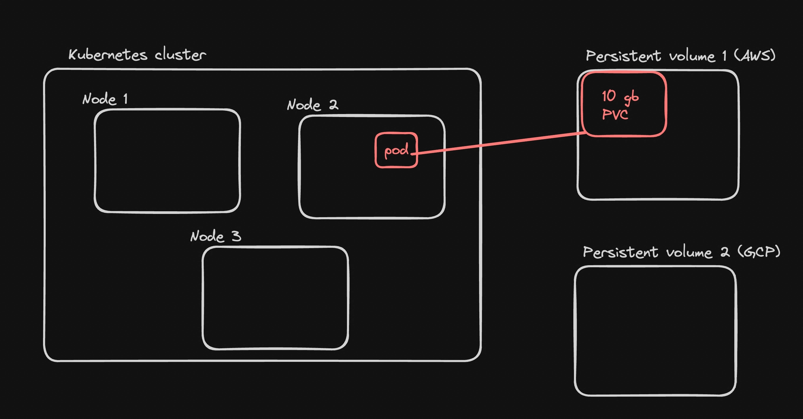

---

### Ephemeral Volumes in Practice

Create a deployment where two containers share the same volume. The `writer` container writes a file, the `reader` container reads it:

```yaml
apiVersion: apps/v1
kind: Deployment
metadata:
  name: shared-volume-deployment
spec:
  replicas: 1
  selector:
    matchLabels:
      app: shared-volume-app
  template:
    metadata:
      labels:
        app: shared-volume-app
    spec:
      containers:
      - name: writer
        image: busybox
        command: ["/bin/sh", "-c", "echo 'Hello from Writer Pod' > /data/hello.txt; sleep 3600"]
        volumeMounts:
        - name: shared-data
          mountPath: /data
      - name: reader
        image: busybox
        command: ["/bin/sh", "-c", "cat /data/hello.txt; sleep 3600"]
        volumeMounts:
        - name: shared-data
          mountPath: /data
      volumes:
      - name: shared-data
        emptyDir: {}
```

Apply it:

```bash
kubectl apply -f deployment.yml
```

Shell into the reader container and verify it can see what the writer wrote:

```bash
kubectl exec -it shared-volume-deployment-<pod-id> --container reader -- sh
cat /data/hello.txt
```

You will see `Hello from Writer Pod`. Both containers are reading and writing to the same directory backed by one `emptyDir` volume. Delete the pod - the volume is gone. A new pod gets a fresh empty volume.

---

### Static Persistent Volumes in Practice

For data that must survive pod restarts, you need a persistent volume. This section uses NFS (Network File System) as the backing storage - a simple, protocol-level shared filesystem that Kubernetes supports natively.

**Step 1 - Run an NFS server**

For this demo, spin one up with Docker:

```yaml
version: '3.7'

services:
  nfs-server:
    image: itsthenetwork/nfs-server-alpine:latest
    container_name: nfs-server
    privileged: true
    environment:
      SHARED_DIRECTORY: /exports
    volumes:
      - ./data:/exports:rw
    ports:
      - "2049:2049"
    restart: unless-stopped
```

Make sure port `2049` is open on whatever machine this runs on.

---

**Step 2 - Create a PV and PVC**

The PV points at the NFS server. The PVC claims storage from it.

```yaml
apiVersion: v1
kind: PersistentVolume
metadata:
  name: nfs-pv
spec:
  capacity:
    storage: 10Gi
  accessModes:
    - ReadWriteMany
  storageClassName: nfs
  nfs:
    path: /exports
    server: <your-nfs-server-ip>
---
apiVersion: v1
kind: PersistentVolumeClaim
metadata:
  name: nfs-pvc
spec:
  accessModes:
    - ReadWriteMany
  resources:
    requests:
      storage: 10Gi
  storageClassName: nfs
```

Breaking down `accessModes`:

- `ReadWriteOnce` - mounted as read/write by a single node
- `ReadWriteMany` - mounted as read/write by multiple nodes simultaneously (NFS supports this)
- `ReadOnlyMany` - mounted as read-only by many nodes

Apply it:

```bash
kubectl apply -f pv.yml
```

---

**Step 3 - Create a pod that uses the PVC**

```yaml
apiVersion: v1
kind: Pod
metadata:
  name: mongo-pod
spec:
  containers:
  - name: mongo
    image: mongo:4.4
    command: ["mongod", "--bind_ip_all"]
    ports:
    - containerPort: 27017
    volumeMounts:
    - mountPath: "/data/db"
      name: nfs-volume
  volumes:
  - name: nfs-volume
    persistentVolumeClaim:
      claimName: nfs-pvc
```

The pod mounts `/data/db` (MongoDB's data directory) to the NFS volume via the PVC. MongoDB writes its data there.

Apply it:

```bash
kubectl apply -f mongodb.yml
```

---

**Step 4 - Verify persistence**

Write some data:

```bash
kubectl exec -it mongo-pod -- mongo
use mydb
db.mycollection.insert({ name: "Test", value: "This is a test" })
exit
```

Delete the pod and bring it back:

```bash
kubectl delete pod mongo-pod
kubectl apply -f mongodb.yml
```

Check if the data is still there:

```bash
kubectl exec -it mongo-pod -- mongo
use mydb
db.mycollection.find()
```

The data is there. The pod was deleted and recreated, but the NFS volume - and the PV - outlived it.

---

### Dynamic PV Provisioning (Cloud)

In the static approach, you manually create the PV before the PVC. This works but it's tedious at scale.

On cloud providers (AWS, GCP, Azure, Vultr), Kubernetes can create the underlying storage automatically when a PVC is submitted. This is called **dynamic provisioning**, and it works through **StorageClasses**.

A StorageClass tells Kubernetes which provisioner to call and with what parameters when a PVC asks for storage.

Check what storage classes are available in your cluster:

```bash
kubectl get storageclass
```

Create a PVC that references a storage class:

```yaml
apiVersion: v1
kind: PersistentVolumeClaim
metadata:
  name: auto-pvc
spec:
  accessModes:
    - ReadWriteOnce
  resources:
    requests:
      storage: 10Gi
  storageClassName: vultr-block-storage-hdd
```

Apply it:

```bash
kubectl apply -f pvc.yml
```

Check what happened:

```bash
kubectl get pvc
kubectl get pv
```

You will see a PVC in `Bound` state and a PV that Kubernetes created automatically - backed by a real block storage volume provisioned by the cloud provider. No manual PV creation needed.

Create a pod using this PVC the same way as before - just reference `claimName: auto-pvc`.

**PV vs PVC Summary:**

```
PersistentVolume (PV)       → the actual storage (NFS share, cloud disk, etc.)
PersistentVolumeClaim (PVC) → a pod's request for storage
StorageClass                → tells Kubernetes how to auto-create PVs on demand

Pod → mounts PVC → PVC binds to PV → PV points to real storage
```

The key insight: pods never reference storage directly. They reference a PVC. This decoupling means you can swap the underlying storage without touching the pod definition.

---

## Horizontal Pod Autoscaler (HPA)

Ref - https://kubernetes.io/docs/tasks/run-application/horizontal-pod-autoscale/

When traffic increases, you need more pods. When it drops, you want fewer pods to avoid wasting resources. Doing this manually is not realistic in production. HPA automates exactly this - it watches your pods' resource usage and adjusts the replica count in your Deployment automatically.

It controls the `replicas` field. That's it. Everything else - scheduling, pod creation, load distribution - is handled by the existing Kubernetes machinery.

```
Low traffic   →  CPU drops below threshold  →  HPA scales down replicas
High traffic  →  CPU crosses threshold       →  HPA scales up replicas
```

**Horizontal** means adding more copies of the same pod. This is different from vertical scaling, where you give an existing pod more CPU or memory. HPA is horizontal - same size pods, just more (or fewer) of them.

---

### How HPA Works Internally

HPA is not a continuous watcher. It runs as a **control loop every 15 seconds**. Each cycle it:

1. Fetches current CPU (or memory) metrics from the metrics-server
2. Compares it against your target utilization
3. Calculates how many replicas are needed
4. Updates the Deployment if the count needs to change

The data pipeline that makes this possible:

```
Container (actual CPU usage)
        |
        v
cAdvisor  -  runs inside kubelet on every node, scrapes per-container metrics
        |
        v
metrics-server  -  aggregates everything cluster-wide, exposes via Kubernetes API
        |
        v
HPA controller  -  polls metrics-server every 15s, calculates desired replicas
        |
        v
Deployment  -  replica count updated
```

**cAdvisor** (Container Advisor) is an open-source agent embedded inside the kubelet. You don't install it separately. It automatically collects CPU, memory, filesystem, and network usage for every container on the node.

**metrics-server** is a lightweight in-memory store. It does NOT persist data and is NOT meant for monitoring. It exists only to give the HPA controller the numbers it needs. It is not installed by default.

---

### Installing metrics-server

```bash
kubectl apply -f https://github.com/kubernetes-sigs/metrics-server/releases/latest/download/components.yaml
```

If the above has issues (common in kind and some cloud clusters due to TLS certificate problems with kubelets), use this fixed version:

```bash
kubectl apply -f https://github.com/abcd
```

Verify it's working:

```bash
kubectl top pods -n kube-system
kubectl top nodes
```

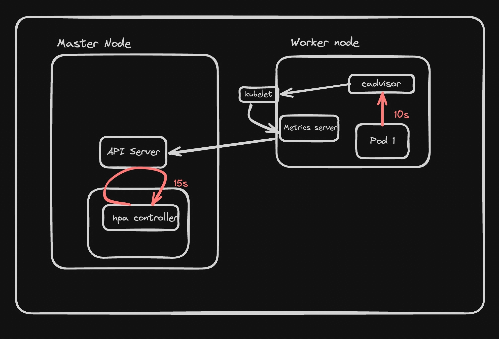

If these return actual CPU and memory numbers, metrics-server is up. If they hang or error, it's not ready yet.

The HPA controller internally hits an endpoint like this to get pod metrics:

```
GET https://<cluster>/apis/metrics.k8s.io/v1beta1/namespaces/default/pods
```

---

### The App for Testing

To actually see HPA work, you need an app that burns CPU. This Node.js app runs a loop up to 10 billion on every request - purely to max out the CPU:

```typescript
import express from 'express';

const app = express();
const BIG_VALUE = 10000000000;

app.get('/', (req, res) => {
    let ctr = 0;
    for (let i = 0; i < BIG_VALUE; i++) {
        ctr += 1;
    }
    res.send('Hello World!');
});

app.listen(3000, () => {
  console.log('Server is running on port 3000');
});
```
---

### Creating the Manifests

**Step 1 - Deployment**

```yaml
apiVersion: apps/v1
kind: Deployment
metadata:
  name: cpu-deployment
spec:
  replicas: 2
  selector:
    matchLabels:
      app: cpu-app
  template:
    metadata:
      labels:
        app: cpu-app
    spec:
      containers:
      - name: cpu-app
        image: project/master:latest
        ports:
        - containerPort: 3000
```

**Step 2 - Service (LoadBalancer to expose it)**

```yaml
apiVersion: v1
kind: Service
metadata:
  name: cpu-service
spec:
  selector:
    app: cpu-app
  ports:
    - protocol: TCP
      port: 80
      targetPort: 3000
  type: LoadBalancer
```

**Step 3 - HPA manifest**

```yaml
apiVersion: autoscaling/v2
kind: HorizontalPodAutoscaler
metadata:
  name: cpu-hpa
spec:
  scaleTargetRef:
    apiVersion: apps/v1
    kind: Deployment
    name: cpu-deployment
  minReplicas: 2
  maxReplicas: 5
  metrics:
  - type: Resource
    resource:
      name: cpu
      target:
        type: Utilization
        averageUtilization: 50
```

Apply all three:

```bash
kubectl apply -f deployment.yml
kubectl apply -f service.yml
kubectl apply -f hpa.yml
```

Check HPA status:

```bash
kubectl get hpa
```

---

### Why Resource Requests Are Required for HPA

If you check `kubectl get hpa` right now, you'll likely see `<unknown>` in the CPU column. HPA calculates utilization as a **percentage of the requested amount**. If you haven't declared what the pod requests, there's no baseline - so the percentage is undefined.

Fix this by adding resource requests and limits to the deployment:

```yaml
containers:
- name: cpu-app
  image: project/master:latest
  ports:
  - containerPort: 3000
  resources:
    requests:
      cpu: "100m"
    limits:
      cpu: "1000m"
```

`100m` = 100 millicores = 0.1 of a single CPU core. This is what HPA uses as the 100% baseline.

Apply the updated deployment:

```bash
kubectl apply -f deployment.yml
```

Check HPA again - you should now see an actual percentage:

```bash
kubectl get hpa
```

---

### Load Testing and Watching HPA React

Install a load testing tool:

```bash
npm i -g loadtest
```

Hit the service hard:

```bash
loadtest -c 10 --rps 200 http://<your-service-external-ip>
```

In a separate terminal, watch things unfold:

```bash
# CPU per pod
kubectl top pods

# HPA current metrics and replica count
kubectl get hpa

# Pod count changing in real time
kubectl get pods
```

You'll see CPU utilization climb above 50%, then the HPA bumping the replica count from 2 toward 5. Stop the load - after the cooldown period (5 minutes by default for scale-down), the replica count drops back.

> You can also scale based on multiple metrics. HPA scales **up** if any single metric crosses its threshold. It scales **down** only when **all** metrics are below their thresholds.

---

### The Scaling Formula

```
desiredReplicas = ceil( currentReplicas × (currentMetricValue / desiredMetricValue) )
```

Example: 2 replicas running, current CPU utilization is 90%, target is 50%:

```
ceil( 2 × (90 / 50) ) = ceil(3.6) = 4
```

HPA scales to 4. Those 4 pods share the load - CPU per pod drops. If it stays below 50% for 5 minutes, HPA scales back down.

The ceiling function (`ceil`) means HPA always rounds up - it would rather over-provision slightly than under-provision and let pods stay saturated.

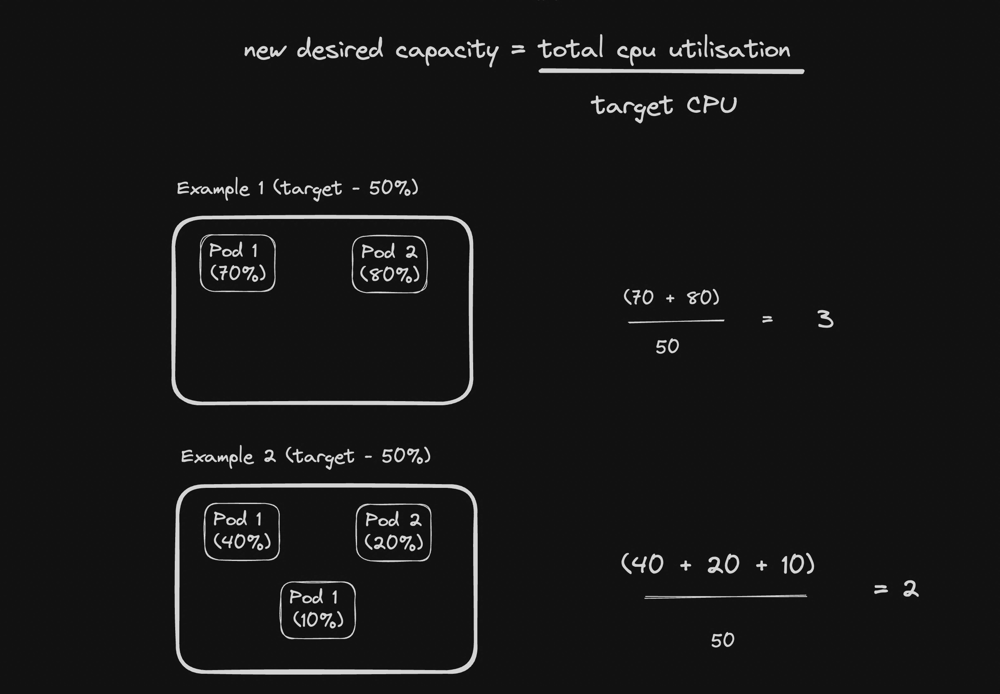

---

## Resource Requests and Limits

Ref - https://kubernetes.io/docs/concepts/configuration/manage-resources-containers/

These are two separate things that people often confuse.

**Request** - the amount of CPU/memory Kubernetes **guarantees** to the container. The scheduler uses this number to decide which node has enough room to place the pod. If you request 500m CPU, the scheduler will only place this pod on a node that has at least 500m CPU available.

**Limit** - the **maximum** the container is allowed to use. If the container tries to exceed this, it gets throttled (CPU) or killed and restarted (memory).

```yaml
resources:
  requests:
    cpu: "100m"
    memory: "128Mi"
  limits:
    cpu: "1000m"
    memory: "256Mi"
```

| | Requests | Limits |
|---|---|---|
| What it means | Guaranteed minimum | Hard maximum |
| Used by | Scheduler (for placement) | kubelet (for enforcement) |
| Can container exceed it? | Yes, if node has headroom | No |
| What happens if exceeded | Nothing - it just uses more | CPU throttled / memory OOMKilled |

**A common setup:** set requests low enough that pods get scheduled easily, set limits high enough that a single bad pod can't eat the whole node.

If a node has 4 CPUs total and all pods on it have a combined CPU request of 3.8 CPUs - a new pod requesting 500m won't be scheduled there, even if the node's actual live CPU usage is only 20%. **Requests are for scheduling decisions, not live usage.**

---

## Cluster Autoscaling

Ref - https://github.com/kubernetes/autoscaler

HPA handles scaling pods. But what happens when the cluster itself doesn't have enough nodes to place those new pods?

In the load test above with a 4-node cluster, HPA wanted 5 replicas but you might have seen pods stuck in `Pending` state because there wasn't enough CPU across all nodes to schedule them. HPA did its job - Kubernetes just had nowhere to put the pods.

**Cluster Autoscaler** solves this. It watches for pods that are in `Pending` state because of insufficient resources, and automatically provisions new nodes. When load drops and nodes sit idle, it removes them.

---

### Enabling It

On cloud providers (GKE, EKS, Vultr), Cluster Autoscaler is enabled by setting a min and max on your node pool in the cloud console. Once enabled, it runs as a pod inside `kube-system`.

Check if it's running:

```bash
kubectl get pods -n kube-system | grep cluster-autoscaler
```

---

### Watching It Scale Up

Delete and recreate a high-replica deployment that needs more resources than your current nodes can provide:

```yaml
apiVersion: apps/v1
kind: Deployment
metadata:
  name: cpu-deployment
spec:
  replicas: 10
  selector:
    matchLabels:
      app: cpu-app
  template:
    metadata:
      labels:
        app: cpu-app
    spec:
      containers:
      - name: cpu-app
        image: project/master:latest
        ports:
        - containerPort: 3000
        resources:
          requests:
            cpu: "1000m"
          limits:
            cpu: "1000m"
```

```bash
kubectl delete deployment cpu-deployment
kubectl apply -f deployment.yml
```

Watch pods:

```bash
kubectl get pods
```

Some will be `Pending`. Watch the node count:

```bash
kubectl get nodes
```

Within a few minutes, new nodes appear and the pending pods get scheduled.

Now scale the deployment back down or delete it. After the idle timeout (default 10 minutes), the extra nodes are terminated and your cluster shrinks back.

---

### HPA and Cluster Autoscaler Together

This is how they work in combination in a real production setup:

```
Traffic increases
      |
      v
HPA: "I need more pods"  →  scales Deployment replicas up
      |
      v
New pods go Pending (not enough node capacity)
      |
      v
Cluster Autoscaler: "There are unschedulable pods"  →  provisions new node
      |
      v
Scheduler places pending pods on the new node
      |
      v
Traffic normalizes  →  HPA scales pods down  →  nodes become idle
      |
      v
Cluster Autoscaler: "These nodes are idle"  →  removes them
```

The two systems are independent but complementary. HPA manages pod count. Cluster Autoscaler manages node count. Together they give you a cluster that breathes with your traffic.