# ☸️ Kubernetes (K8s)

## Table of Contents

- [What is Kubernetes](#what-is-kubernetes)
- [The Problem Before Kubernetes](#the-problem-before-kubernetes)
- [With Kubernetes](#with-kubernetes)
- [Cluster Architecture](#cluster-architecture)
  - [Node](#node)
  - [The Master Node (Control Plane)](#the-master-node-control-plane)
    - [API Server](#1-api-server-kube-apiserver)
    - [etcd](#2-etcd)
    - [kube-scheduler](#3-kube-scheduler)
    - [kube-controller-manager](#4-kube-controller-manager)
  - [Worker Nodes](#worker-nodes-compute-nodes)
    - [kubelet](#1-kubelet)
    - [kube-proxy](#2-kube-proxy)
    - [Container Runtime](#3-container-runtime)
- [Pods](#pods)
- [Creating a Kubernetes Cluster](#creating-a-kubernetes-cluster)
  - [Single Node Setup](#single-node-setup)
  - [Multi Node Setup](#multi-node-setup)
  - [Managing Clusters and Contexts](#managing-clusters-and-contexts)
- [Creating a Pod](#creating-a-pod)
  - [Starting a Pod Using kubectl](#starting-a-pod-using-kubectl)
  - [Creating a Pod Using a Manifest File](#creating-a-pod-using-a-manifest-file)
- [Deployment](#deployment)
  - [Problem with Raw Pods](#problem-with-raw-pods)
  - [ReplicaSet](#replicaset)
  - [Deployment Resource](#deployment-resource)
  - [Internal Flow of a Deployment](#internal-flow-of-a-deployment)
- [Services](#services)
  - [ClusterIP](#clusterip-default)
  - [NodePort](#nodeport)
  - [LoadBalancer](#loadbalancer)

---

## What is Kubernetes

Kubernetes (often written as **K8s**) is a container orchestration system.

- **Container** — a packaged application, usually built with Docker
- **Orchestration** — managing many containers automatically

So Kubernetes manages containers at scale. Instead of manually running containers on servers, Kubernetes automatically deploys, scales, heals, and manages them.

The bigger selling points:

- You stop worrying about patching and crashes. The system auto-heals.
- You have your Docker images in a registry and want to deploy in a cloud-native way — for example, moving from AWS to GCP without reworking your setup.

Think of Kubernetes as a manager of containers spread across many machines.

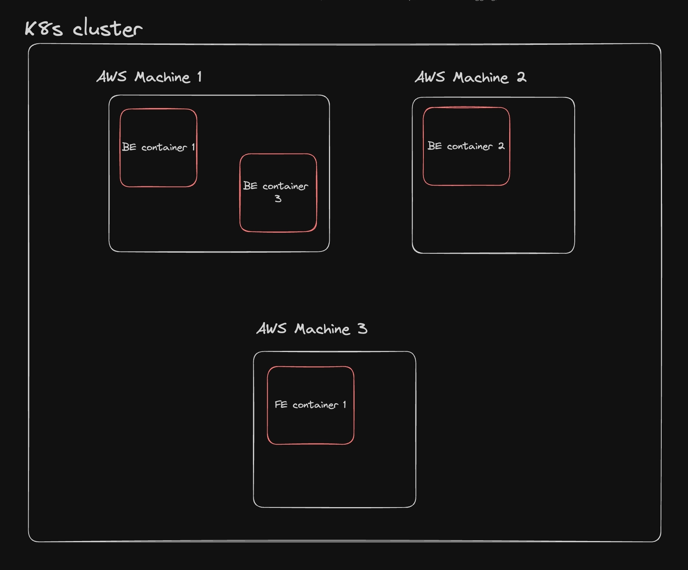

---

## The Problem Before Kubernetes

Without Kubernetes, you run containers manually:

```
docker run my-app
docker run my-app
docker run my-app
```

Problems with this approach:

- If a container crashes, you restart it manually.
- If traffic increases, you manually start more containers.
- If a server dies, those containers are gone.
- Hard to monitor at scale.

---

## With Kubernetes

You just describe the desired state:

```
I want 5 instances of my app running.
```

Kubernetes ensures:

- 5 containers are running at all times
- If one crashes, it restarts
- If a server dies, it moves the container to another machine
- If traffic increases, it scales

This is called **Declarative Infrastructure**.

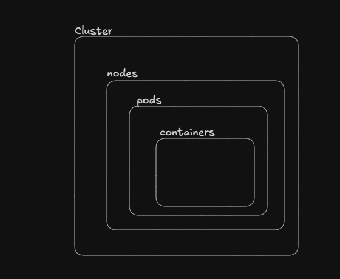

---

## Cluster Architecture

### Node

A **Node** is a single computer. It can be:

- A physical server in a data center
- A Virtual Machine from a cloud provider (like an AWS EC2 instance or a Google Cloud Compute instance)
- Your personal laptop

A collection of connected Nodes is called a **Cluster**.

---

### The Master Node (Control Plane)

The Master Node is the brain of the operation — the management layer. Its only job is to manage the cluster, make decisions, and keep everything running smoothly. It does **not** run your actual application code.

It handles deploying containers, healing them, and listening to what the developer wants to deploy.

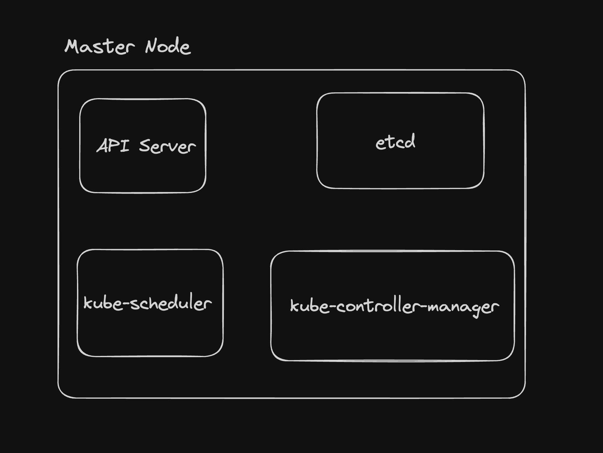

---

#### 1. API Server (`kube-apiserver`)

The `kube-apiserver` is the front-end of the Kubernetes control plane. It exposes the Kubernetes HTTP/REST API and is the **entry point into Kubernetes**.

- **Stateless Operation:** The API server itself is stateless; it relies entirely on `etcd` for state storage.
- **Component Communication:** It is the only component that communicates directly with `etcd`. All other components must query the API server to read or modify cluster state.
- **Authentication & Authorization:** Acts as a security gateway, authenticating requests via client certificates or bearer tokens, and authorizing them typically via RBAC before any action is executed.
- **Validation & Mutation:** Validates incoming resource configurations (YAML manifests) to ensure they are properly formatted before persisting them.

---

#### 2. etcd

`etcd` is a consistent, highly-available, distributed key-value database. It is the **database of Kubernetes**. If Kubernetes restarts, it reads from `etcd` to restore state.

- **The Source of Truth:** Holds the definitive, persistent state of the entire cluster — all configuration data, current statuses, and metadata.
- **Watch Functionality:** Provides a "watch" API that the `kube-apiserver` uses to monitor for changes. When a resource is updated, `etcd` instantly notifies the API server.
- **Critical Dependency:** If `etcd` becomes unavailable or its data is corrupted, the cluster cannot be updated and existing state is lost. Backing up `etcd` is the primary disaster recovery mechanism for a Kubernetes cluster.

---

#### 3. kube-scheduler

The `kube-scheduler` is responsible for assigning newly created Pods to available Worker Nodes.

- **Watch Mechanism:** Continuously polls the API Server for newly created Pods that don't yet have a node assigned.
- **Two-Step Scheduling Process:**
  1. **Filtering (Predicates):** Eliminates nodes that cannot run the Pod based on resource limits, hardware/software constraints, node taints, or required host ports.
  2. **Scoring (Priorities):** Ranks the remaining eligible nodes based on factors like balanced resource utilization and pod affinity/anti-affinity rules.
- **Binding:** Selects the highest-scoring node and sends a Binding request back to the API Server to officially assign the Pod.

---

#### 4. kube-controller-manager

The `kube-controller-manager` is a single binary that embeds several distinct, independent control loops (controllers).

- **The Reconciliation Loop:** Every controller operates on a continuous loop, watching the cluster's actual state and actively working to match it to the desired state defined by the user in `etcd`.
- **Core Embedded Controllers:**
  - **Node Controller:** Monitors `kubelet` heartbeats from worker nodes. If a node stops responding, it marks it as unreachable and initiates Pod eviction.
  - **ReplicaSet Controller:** Monitors the number of running Pods for a given application. If a Pod crashes, it immediately issues a request to create a replacement.
  - **Deployment Controller:** Manages declarative rollout of application updates. Creates new ReplicaSets, scales them up, and scales down old ones to ensure zero-downtime deployments.
  - **Endpoints / EndpointSlice Controller:** Maps the network addresses of running Pods to their corresponding Service, keeping network traffic routing up to date as Pods are created or destroyed.

---

### Worker Nodes (Compute Nodes)

Worker nodes are the compute machines (physical or virtual) where your containerized applications actually run. They are managed by the control plane.

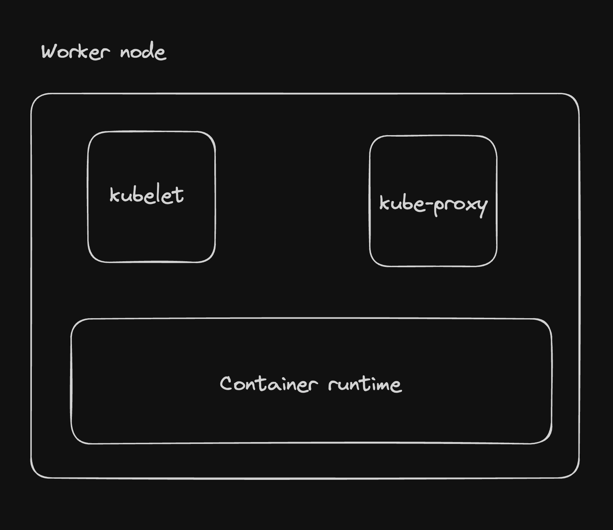

---

#### 1. kubelet

The `kubelet` is the core process running on every worker node. It bridges the node with the control plane and communicates with the API server.

- **Registration:** Registers the node it is running on with the API Server.
- **Pod Execution:** Takes `PodSpecs` provided by the API Server and ensures that the containers described in those specs are running and healthy.
- **Status Reporting:** Continuously monitors and reports the status of the node (CPU, memory, disk) and the Pods (running, failed, pending) back to the API Server.
- **Probes:** Executes readiness, liveness, and startup probes to determine container health, restarting containers that fail their liveness checks.
- **Limitation:** The `kubelet` only manages containers created by Kubernetes. It will not manage containers started directly through the container runtime outside of Kubernetes' awareness.

---

#### 2. kube-proxy

`kube-proxy` is a network proxy running on each node that implements the Kubernetes `Service` concept. It handles network communication inside the cluster and allows services to reach pods.

- **Rule Management:** Maintains network routing rules on the host node, typically using `iptables` or `IPVS` on Linux.
- **Traffic Routing:** When a request hits a Service IP, `kube-proxy` intercepts it and forwards it to the correct backend Pod.
- **Network Load Balancing:** If a Service maps to multiple Pod replicas, `kube-proxy` distributes incoming TCP/UDP traffic across the available Pods.

---

#### 3. Container Runtime

Kubernetes does not run containers directly — it delegates this to the container runtime via the Container Runtime Interface (CRI).

- **Core Function:** Pulls container images from a registry (Docker Hub, AWS ECR, Google GCR, etc.), unpacks them, and starts/stops the actual container processes.
- **CRI Compliance:** Modern Kubernetes uses runtimes that comply with the CRI standard.
- **Common Implementations:**
  - **containerd** — an industry-standard core container runtime, originally part of Docker, now standalone.
  - **CRI-O** — a lightweight runtime built specifically for Kubernetes, completely bypassing Docker.

---

## Pods

A Pod is the smallest and simplest unit in the Kubernetes object model that you can create or deploy. Kubernetes does not deploy containers directly — it deploys Pods that wrap one or more containers.

Key characteristics:

- **Atomic Scaling:** You cannot scale by adding half a Pod or adding a container to an existing Pod. Scaling means adding or removing entire Pods.
- **Ephemeral (Mortal):** Pods are temporary. If a node fails or a Pod is evicted, it dies and is never resurrected. A completely new, identical Pod is created to replace it.
- **Immutable:** Once running, core configurations like network namespace or container image cannot be changed. Updates require destroying the old Pod and deploying a new one.

**Why do we need Pods and not just run containers directly?**

Containers inside a Pod share resources (network, storage), which makes it easier for them to communicate. For example, a backend, a secondary backend, a frontend, and a Redis instance inside the same Pod can talk over localhost.

### Resource Sharing Inside a Pod

All containers inside the same Pod share:

- **Network Namespace:** The Pod gets one unique IP address. All containers inside share this IP and port space and communicate with each other via `localhost`.
- **Storage (Volumes):** Shared storage volumes can be defined at the Pod level. All containers inside can mount and read/write to the same volumes.
- **IPC (Inter-Process Communication):** Containers in the same Pod can use standard IPC mechanisms like SystemV semaphores.

---

## Creating a Kubernetes Cluster

You can create a cluster locally using [kind](https://kind.sigs.k8s.io/) (Kubernetes in Docker), or on the cloud via:

- GKE (Google Kubernetes Engine)
- AWS EKS
- Vultr Kubernetes Engine

### Single Node Setup

Create a 1-node cluster:

```bash
kind create cluster --name local

# If the above doesn't work:
kind create cluster --name local --image kindest/node:v1.29.4
```

Check the running Docker containers:

```bash
docker ps
```

You will see a single container running (the control-plane). To delete the cluster:

```bash
kind delete cluster -n local
```

---

### Multi Node Setup

Create a `clusters.yml` file:

```yaml
kind: Cluster
apiVersion: kind.x-k8s.io/v1alpha4
nodes:
- role: control-plane
- role: worker
- role: worker
```

Create the cluster:

```bash
kind create cluster --config clusters.yml --name local

# or with a specific node image:
kind create cluster --config clusters.yml --name local --image kindest/node:v1.29.4
```

Check your Docker containers again:

```bash
docker ps
```
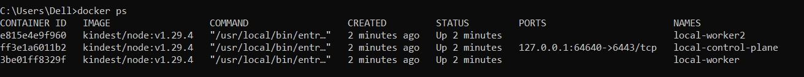

You will now see a control-plane and two worker nodes running.

---

### Managing Clusters and Contexts

You will always hit the **master node** port since it is the only node exposed to the outside world.

Check cluster info:

```bash
kubectl cluster-info --context kind-100x-k8s
```

Find the cluster credentials:

```bash
cat ~/.kube/config
```

This file contains the credentials needed to access the cluster.

**kubectl** is a command-line tool for interacting with Kubernetes clusters. It communicates with the Kubernetes API server to manage resources.

List all nodes in the current cluster:

```bash
kubectl get nodes
```

To see the exact HTTP requests being sent to the API server:

```bash
kubectl get nodes --v=8
```

**See all configured clusters:**

```bash
kubectl config get-clusters
```
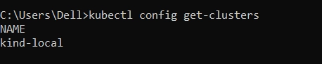

**Check the active context:**

```bash
kubectl config current-context
```

**See all contexts:**

```bash
kubectl config get-contexts
```

Example output:

```
CURRENT   NAME
          kind-local
*         kind-local2
```

The `*` shows the active context.

**Switch to a different cluster:**

```bash
kubectl config use-context kind-local
```

All `kubectl` commands will now point to `kind-local`.

---

## Creating a Pod

### Starting a Pod Using kubectl

```bash
kubectl run <pod_name> --image=<image_name> --port=80

# Example:
kubectl run nginx --image=nginx --port=80
```

Check pod status:

```bash
kubectl get pods
```
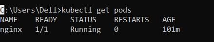

Check logs:

```bash
kubectl logs nginx
```

Describe the pod:

```bash
kubectl describe pod nginx
```

Note which worker node the pod has been scheduled on.

Delete the pod:

```bash
kubectl delete pod nginx
```

> At this point, you cannot access the pod from outside the cluster. That requires understanding Services, which is covered below.

---

### Creating a Pod Using a Manifest File

Instead of re-running `kubectl run` every time, you can define the pod in a manifest file.

Create a `pod-manifest.yml` file:

```yaml
apiVersion: v1
kind: Pod
metadata:
  name: nginx
spec:
  containers:
    - name: nginx
      image: nginx
      ports:
        - containerPort: 80
```
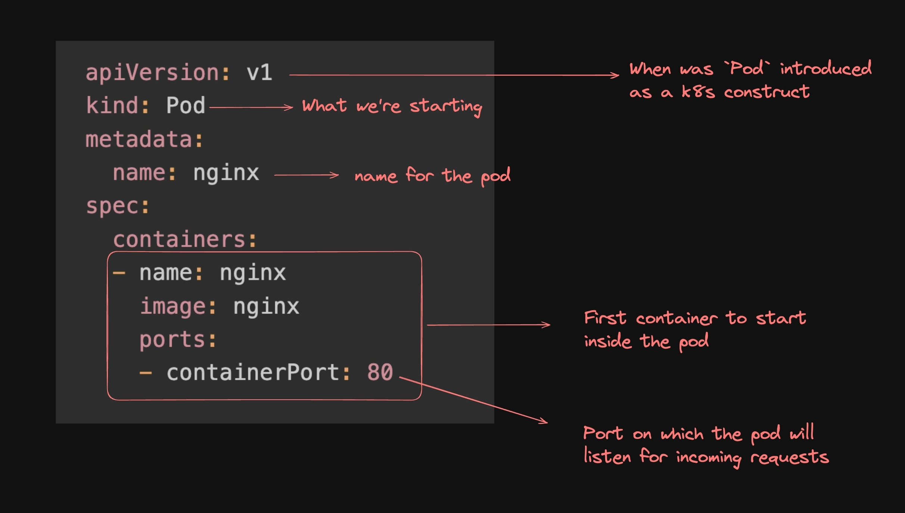

Apply the manifest:

```bash
kubectl apply -f pod-manifest.yml
```

Check the pods:

```bash
kubectl get pods
```

**Which cluster does this pod get created in?**

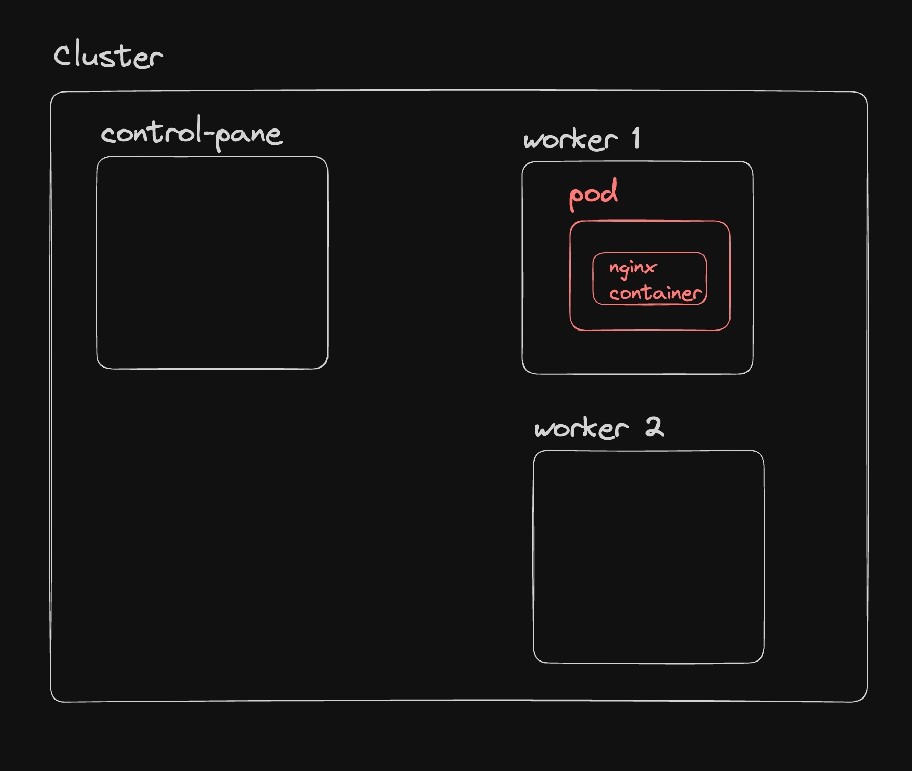

Check your current context:

```bash
kubectl config current-context
```

Whatever cluster that context points to is where the pod will be created. When you create a cluster with kind, it automatically sets the context to that new cluster.

---

## Deployment

A `Deployment` is a higher-level concept that manages Pods and ReplicaSets. It provides:

- **Rollouts and Rollbacks** — update pods with new images and roll back if something goes wrong
- **Scaling** — start and stop pods based on load
- **Self-Healing** — replaces failed pods automatically

---

### Problem with Raw Pods

If you create a Pod manually:

```bash
kubectl run nginx --image=nginx
```

Issues:
- If the Pod dies, it is **not restarted automatically**
- No scaling
- No rolling updates

This is why controllers exist.

---

### ReplicaSet

A **ReplicaSet (RS)** ensures a specified number of identical Pods are always running.

```yaml
apiVersion: apps/v1
kind: ReplicaSet
metadata:
  name: nginx-replicaset
spec:
  replicas: 3
  selector:
    matchLabels:
      app: nginx
  template:
    metadata:
      labels:
        app: nginx
    spec:
      containers:
      - name: nginx
        image: nginx:latest
        ports:
        - containerPort: 80
```

Apply it:

```bash
kubectl apply -f rs.yml
```

Check the ReplicaSet:

```bash
kubectl get rs
```

Check the pods:

```bash
kubectl get pods
```

Try deleting a pod — the ReplicaSet will immediately create a replacement:

```bash
kubectl delete pod nginx-replicaset-7zp2v
kubectl get pods
```

Try manually creating a pod with the same label `app=nginx`:

```bash
kubectl run nginx-pod --image=nginx --labels="app=nginx"
```

The ReplicaSet will terminate it immediately because it already has 3 pods matching that label.

Delete the ReplicaSet:

```bash
kubectl delete rs nginx-replicaset
```

**How ReplicaSet selects pods:**

It uses a label selector. It manages **all pods with matching labels**, regardless of how they were created.

```yaml
selector:
  matchLabels:
    app: nginx
```

**Limitation of ReplicaSet:**

ReplicaSet cannot handle updates properly. If you change the image version, it kills old pods and creates new ones all at once, which can cause downtime. That's where Deployments come in.

---

### Deployment Resource

A **Deployment** manages ReplicaSets and provides rolling updates, rollbacks, and version control.

```
Deployment → manages ReplicaSets
ReplicaSets → manage Pods
```

```yaml
apiVersion: apps/v1
kind: Deployment
metadata:
  name: nginx-deployment
spec:
  replicas: 3
  selector:
    matchLabels:
      app: nginx
  template:
    metadata:
      labels:
        app: nginx
    spec:
      containers:
      - name: nginx
        image: nginx:latest
        ports:
        - containerPort: 80
```

**Configuration breakdown:**

- `apiVersion` — Kubernetes API version being used
- `kind` — the resource type (`Deployment`)
- `metadata` — contains the name of the deployment
- `spec.replicas` — number of pods to run
- `spec.selector` — tells the deployment which pods it manages, matched by labels
- `spec.template` — the pod template. This is identical to how you'd define a standalone pod

Apply the deployment:

```bash
kubectl apply -f deployment.yml
```

Check the deployment:

```bash
kubectl get deployment
```

Check the ReplicaSet it created:

```bash
kubectl get rs
```

Check the pods:

```bash
kubectl get pods
```

Delete a pod to verify self-healing:

```bash
kubectl delete pod nginx-deployment-576c6b7b6-b6kgk
kubectl get pods
```

Delete the deployment:

```bash
kubectl delete deployment nginx-deployment
```

**Rollouts and Rollbacks in practice:**
**Why do we even need a Deployment?**

- As we saw above, a deployment was only creating the ReplicaSet.
- It was the ReplicaSet that was creating and managing the pods.
- So, why do we even need a deployment?
- **The answer is `Rollouts and Rollbacks`.**

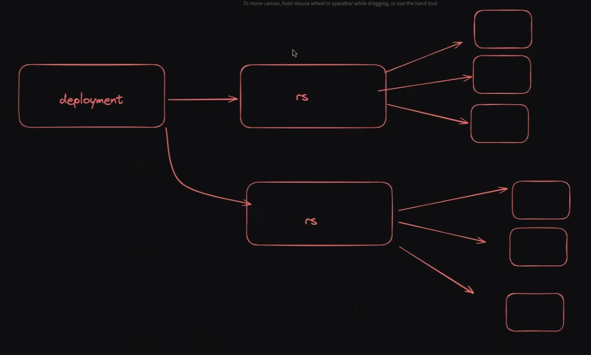

**Understanding with a situation**
Assume your deployment is running 3 pods. You push a new image with a bug. The Deployment:

1. Creates a new ReplicaSet with the new image
2. Starts new pods and checks if they come up healthy
3. If healthy — deletes the old ReplicaSet
4. If not healthy — automatically rolls back to the previous ReplicaSet

---

### Internal Flow of a Deployment

When you run:

```bash
kubectl create deployment nginx --image=nginx --replicas=3
```

Step by step:

```
1. kubectl → API Server
2. API Server → stores state in etcd
3. Deployment controller sees new deployment
4. Deployment controller creates a ReplicaSet
5. ReplicaSet creates Pods
6. Scheduler assigns Pods to nodes
7. kubelet on each node starts the containers
```
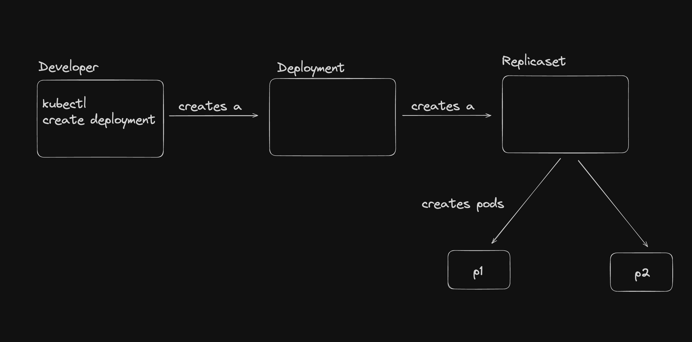

---

## Services

In Kubernetes, a **Service** is an abstraction that provides a stable network endpoint to access a group of Pods. It defines a logical set of Pods and a policy by which to access them.

Since Pods are ephemeral and their IPs change on restart, Services give you a consistent address to reach them.

Key concepts:

- **Pod Selector** — Services use labels to identify which Pods they target
- **Endpoints** — automatically created and updated by Kubernetes as Pods are created or destroyed

```yaml
selector:
  app: nginx
```

This selector matches all Pods with the label `app=nginx` and dynamically tracks them.

---

### ClusterIP (Default)

Internal communication only. Accessible **only inside the cluster**. Used for microservice-to-microservice communication.

```yaml
type: ClusterIP
```

Use case: backend services, databases, internal APIs.

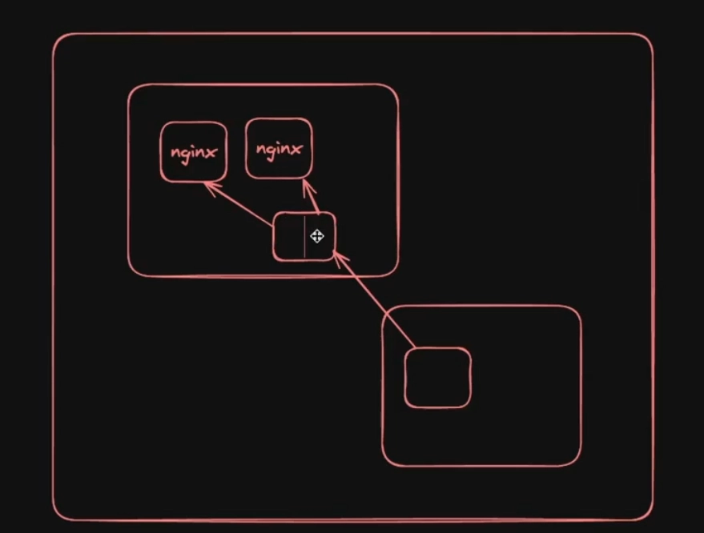

---

### NodePort

Exposes the service outside the cluster in a basic way. Opens a port on every node in the cluster.

```yaml
type: NodePort
nodePort: 30007
```

Accessible via:

```
<NodeIP>:<NodePort>
```

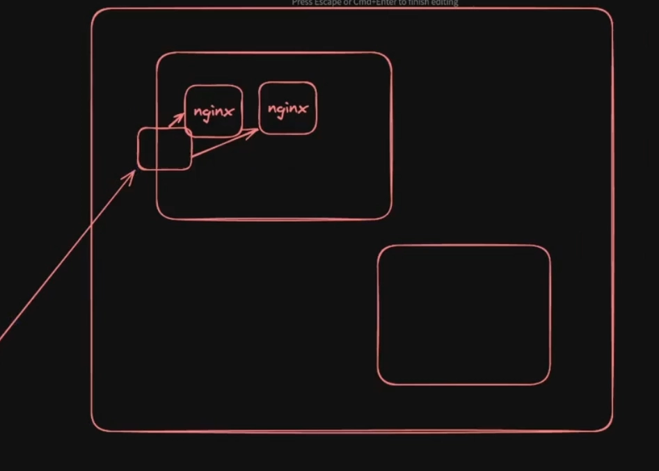


**Example NodePort Service manifest:**

```yaml
apiVersion: v1
kind: Service
metadata:
  name: nginx-service
spec:
  selector:
    app: nginx
  ports:
    - protocol: TCP
      port: 80
      targetPort: 80
      nodePort: 30007
  type: NodePort
```

**Configuration breakdown:**

- `selector` — identifies which pods this service routes traffic to
- `port` — the port the service listens on
- `targetPort` — the port the service forwards traffic to inside the pod
- `nodePort` — the port exposed on each node in the cluster (must be within the NodePort range, typically 30000–32767)

Apply the service:

```bash
kubectl apply -f service.yml
```

Check services:

```bash
kubectl get services
```

**Using NodePort with kind:**

Since kind runs inside Docker, you need to explicitly map the NodePort when creating the cluster. Delete the old cluster first:
To access the service, we need to port-map the NodePort to the ClusterIP of the service. So, in short, we restart the clusters with the port mapping configured. 

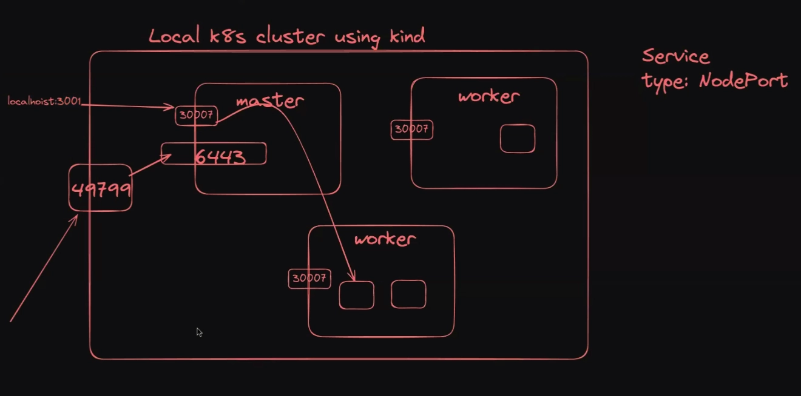


```bash
kind delete cluster --name local
```

Create a new cluster with port mapping configured in `kind-port-map.yml`:

```yaml
kind: Cluster
apiVersion: kind.x-k8s.io/v1alpha4
nodes:
 - role: control-plane
   extraPortMappings:
   - containerPort: 30007
     hostPort: 30007
 - role: worker
 - role: worker
```

```bash
kind create cluster --config kind-port-map.yml --name local
```

Recreate your deployment and service:

```bash
kubectl apply -f deployment.yml
kubectl apply -f service.yml
```

You can now access the service at `http://localhost:30007`.

**Disadvantage of NodePort:**

Exposing a port on every node is not ideal for production. You're essentially binding your application to raw node IPs, which changes when nodes are replaced.

- The `NodePort` service exposes the service on a port on each node in the cluster.
- This means that the service is accessible from outside the cluster using the `<NodeIP>:<NodePort>`.
- But, this is not a good way to expose the service to the outside world.
---

### LoadBalancer

A **LoadBalancer Service** is the production-grade way to expose your application to the outside world. When you create a Service of type `LoadBalancer`, Kubernetes automatically provisions an external load balancer from your cloud provider.

```yaml
apiVersion: v1
kind: Service
metadata:
  name: nginx-service
spec:
  selector:
    app: nginx
  ports:
    - port: 80
      targetPort: 80
  type: LoadBalancer
```

Apply it:

```bash
kubectl apply -f service-lb.yml
```

**What Kubernetes does automatically:**

1. Creates a ClusterIP (internal service)
2. Creates a NodePort automatically
3. Requests an external Load Balancer from your cloud provider
4. Assigns a public IP
5. Routes external traffic to the internal Pods

**Traffic flow:**

Say your service got external IP `203.0.113.10`:

1. User hits `http://203.0.113.10`
2. Cloud Load Balancer receives the request
3. Forwards traffic to any Node in the cluster via NodePort
4. Node forwards to the Service (ClusterIP)
5. Service load balances across the matching Pods
6. Pod responds back through the same path